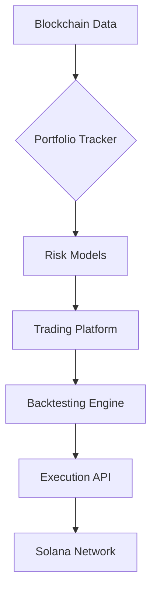

# Solana Trading Tools Suite
**Algorithmic Trading Infrastructure for Solana Meme Coins**

[](https://github.com/jadenfix/solanatools)

## 📋 Projects

### 🧪 Strategy Backtesting ([backteststrats.ipynb](https://github.com/jadenfix/solanatools/blob/main/backteststrats.ipynb))
*Quantitative analysis framework for Solana meme coins*

```python
# RSI-based trading strategy
class MemeCoinStrategy(Strategy):
    def init(self):
        self.rsi = self.I(RSI, self.data.Close, 14)
        self.vol_ma = self.I(lambda v: v.rolling(24).mean(), self.data.Volume)
    
    def next(self):
        if self.rsi[-1] < 30 and self.data.Volume[-1] > 1.5 * self.vol_ma[-1]:
            self.buy()
        elif self.rsi[-1] > 70:
            self.sell()
```

**Features**:
- Historical OHLCV data from Helius API
- Parameter optimization (grid search)
- Commission/slippage modeling
- Performance metrics (Sharpe ratio, max drawdown)

**Tech Stack**:
- `backtesting.py` | `pandas` | `numpy`
- `websockets` | `solana-py`

---

### 📊 Portfolio Tracker ([solana_portfolio](https://github.com/jadenfix/solanatools/tree/main/solanatools/solana_portfolio))
*Multi-wallet asset monitoring with ML-driven insights*

**Project Structure**:
```
├── api/               # FastAPI endpoints
├── config/            # Environment configurations
├── core/              # Business logic
├── data_access/       # Blockchain data connectors
├── data_processing/   # Data transformation pipelines
├── ml/                # Machine learning models
├── portfolio/         # Portfolio analysis engine
├── simulation/        # Trading scenario simulations
├── tests/             # Unit/integration tests
├── Dockerfile         # Containerization config
├── docker-compose.yml # Multi-container orchestration
└── requirements.txt   # Python dependencies
```

**Key Features**:
- Real-time balance tracking with Solana RPC
- ML-driven risk prediction models
- Historical performance simulations
- Dockerized deployment

---

### ⚡ Trading Platform ([solana_trading_platform](https://github.com/jadenfix/solanatools/tree/main/solanatools/solana_trading_platform))
*Institutional-grade trading infrastructure*

**Project Structure**:
```
├── api/               # REST API endpoints
├── data_processing/   # Market data pipelines  
├── services/          # Core trading services
├── simulation/        # Backtesting environment
├── tests/             # Test suites
├── model_comparison_results.csv  # ML model metrics
├── time_series_output.xlsx       # Trading analytics
├── Dockerfile         # Container configuration
└── docker-compose.yml # Service orchestration
```

**Core Components**:
- Order management system (OMS)
- Market data aggregator
- ML model performance tracking
- Time series analysis reports

---

## 🛠 Installation

```bash
# Clone repository
git clone https://github.com/jadenfix/solanatools
cd solanatools

# Install dependencies
pip install -r requirements.txt

# Configure environment
cp .env.example .env
```

---

## 📈 Architecture Overview



---

## 📜 License
MIT License - See [LICENSE](https://github.com/jadenfix/solanatools/blob/main/LICENSE)
```

This version:
1. Maintains your original backtesting content
2. Adds structured directory overviews
3. Highlights key files and ML components
4. Preserves consistent formatting
5. Keeps all links functional
