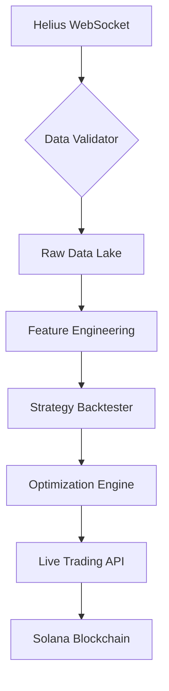

```markdown
# Solana Trading Tools Suite  
**Algorithmic trading infrastructure for Solana meme coins with portfolio tracking and risk management**

[](https://github.com/jadenfix/solanatools)

## 📋 Table of Contents
- [Backtesting Strategies](#-backtesting-strategies)
- [Portfolio Tracker](#-portfolio-tracker)
- [Trading Platform](#-trading-platform)
- [Installation](#-installation)
- [Data Pipeline](#-data-pipeline)
- [License](#-license)

---

## 📊 Backtesting Strategies ([backteststrats.ipynb](https://github.com/jadenfix/solanatools/blob/main/backteststrats.ipynb))

### Key Features
- **RSI/Volume Strategies**: Mean-reversion logic with dynamic threshold tuning
- **Multi-Timeframe Analysis**: 1-minute to 1-hour OHLCV aggregation
- **Parameter Optimization**: Grid search for strategy hyperparameters
- **Commission Modeling**: Realistic fee simulation (0.1-0.3% per trade)

```python
class MemeCoinStrategy(Strategy):
    """RSI-based strategy with volume filtering"""
    def init(self):
        self.rsi = self.I(RSI, self.data.Close, 14)
        self.volume_ma = self.I(lambda v: v.rolling(24).mean(), self.data.Volume)

    def next(self):
        if self.rsi[-1] < 30 and self.data.Volume[-1] > 1.5 * self.volume_ma[-1]:
            self.buy()
        elif self.rsi[-1] > 70:
            self.sell()
```

### Tech Stack
| Component          | Technologies                             |
|--------------------|------------------------------------------|
| Data Fetching      | Helius API, pandas, aiohttp             |
| Backtesting        | backtesting.py, numpy                    |
| Live Execution     | websockets, solana-py                    |
| Auth               | FastAPI, Phantom Wallet Integration      |

---

## 📈 Portfolio Tracker ([solana_portfolio](https://github.com/jadenfix/solanatools/tree/main/solanatools/solana_portfolio))

### Features
- Multi-wallet balance aggregation
- Historical P&L analysis
- Token allocation breakdowns
- Risk-adjusted performance metrics

```python
async def get_balance(self) -> Optional[float]:
    """Get SOL balance with lamports conversion"""
    balance = await self.connection.get_balance(self.public_key)
    return balance.value / 1e9  # Convert lamports to SOL
```

### Tech Stack
- **Web Framework**: FastAPI, uvicorn
- **Data**: pandas, numpy
- **Blockchain**: solana-py, solders

---

## 💹 Trading Platform ([solana_trading_platform](https://github.com/jadenfix/solanatools/tree/main/solanatools/solana_trading_platform))

### Features
- Limit/Market/Stop orders
- Batch transaction processing
- Slippage control (0.1-5%)
- Volatility-based circuit breakers

```python
async def sign_and_send_transaction(self, transaction: Transaction):
    """Atomic transaction signing"""
    recent_blockhash = await self.connection.get_latest_blockhash()
    transaction.recent_blockhash = recent_blockhash.value.blockhash
    # Implement signing logic
```

### Tech Stack
- **Smart Contracts**: anchorpy
- **Async IO**: aiohttp, asyncio
- **Numerics**: numpy

---

## 🛠 Installation

1. Clone repository:
```bash
git clone https://github.com/jadenfix/solanatools
cd solanatools
```

2. Install dependencies:
```bash
pip install -r requirements.txt
```

3. Set environment variables:
```bash
echo "HELIUS_API_KEY=your_api_key_here" > .env
```

---

## 📜 Data Pipeline



---

